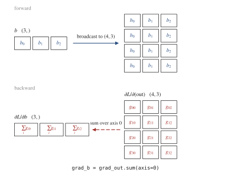

# A guide to the engine

I rebuilt micrograd to understand it, then kept going into forward mode and
second order because I wanted to know how those work too. Karpathy made the
original; this is my study of it. The guide walks the repo in the order it was
built. Each section states the idea, shows the minimal mechanism, names the
check that verifies it, and notes what broke while building it. Exercises are
at the point where you have just learned enough to do them.

What you need coming in: comfortable Python, the single-variable chain rule,
and a little linear algebra (matrix times vector). Section 0 builds the rest.
If autodiff is completely new, run `walkthrough.ipynb` first; it constructs
the scalar engine one cell at a time.

Run everything up front so the outputs are real to you:

```bash
uv sync
uv run python -m pytest -q     # the whole suite
uv run python micrograd.py     # scalar engine, worked example
uv run python dual.py          # the adjoint identity
uv run python secondorder.py   # Newton vs gradient descent
uv run python implicit.py      # differentiate through an argmin
uv run python hvp.py           # Hessian-vector products
uv run python viz.py           # draws assets/example_graph.svg
uv run python train_gpt.py     # the GPT memorizes its line
```

## 0. The math you need

A derivative measures sensitivity: nudge the input by $h$, the output moves by
about $f'(x) \cdot h$. Everything below is bookkeeping for that one idea.

For a function with several inputs, the gradient collects one sensitivity per
input: $\nabla f = (\partial f/\partial x_1, \ldots, \partial f/\partial x_n)$.

For a function with several inputs *and* several outputs, the sensitivities
form a matrix, the Jacobian: $J_{ij} = \partial(\text{output}_i) /
\partial(\text{input}_j)$. Worked example: $f(x, y) = (xy,\; x + y)$ has

$$J = \begin{pmatrix} y & x \\ 1 & 1 \end{pmatrix},
\qquad \text{at } (2, 3):\;
\begin{pmatrix} 3 & 2 \\ 1 & 1 \end{pmatrix}$$

The chain rule for composed functions is matrix multiplication of Jacobians:
$J_{g \circ f}(x) = J_g(f(x)) \cdot J_f(x)$. That is the whole secret of
autodiff: every program is a composition of small functions whose Jacobians we
know, so its derivative is a product of known matrices, and the two autodiff
modes are just the two sensible orders to multiply them in.

The Hessian $H$ is the matrix of second derivatives of a scalar function,
$H_{ij} = \partial^2 f / \partial x_i \partial x_j$. It describes curvature.
That is all of Part 2.

A glossary at the end of this guide has one-line definitions for every term
used below.

## 1. Reverse mode: the chain rule, backward (`micrograd.py`, `engine.py`)

The question: given a value computed from inputs through many small
operations, fill in $\partial f / \partial(\text{input})$ for every input, in
one pass.

The mechanism: each `Value` (scalar) or `Tensor` (array) remembers which
operation produced it and stores a closure holding that operation's local
derivative. `backward()` topologically sorts the graph, seeds the output's
gradient with 1, and walks the order in reverse; each node passes gradient to
its inputs with `+=`.


Trace it once by hand and the mystery goes. Take $f = \tanh(a \cdot b + c)$
with $a = 2$, $b = -3$, $c = 10$. Forward: $e = ab = -6$, $d = e + c = 4$,
$f = \tanh(4) = 0.999329$. Backward, node by node:

| node | local derivative | incoming grad | pushes to inputs |
|---|---|---|---|
| $f = \tanh(d)$ | $1 - \tanh^2(d) = 0.001341$ | $1$ | $d$: $0.001341$ |
| $d = e + c$ | $1$ for each input | $0.001341$ | $e$: $0.001341$, $c$: $0.001341$ |
| $e = a \cdot b$ | $b$ w.r.t. $a$; $a$ w.r.t. $b$ | $0.001341$ | $a$: $-0.004023$, $b$: $0.002682$ |

`viz.py` draws this exact graph with the values and gradients filled in, so
you can check the table against the picture:


And check it against the ground truth that needs no theory, nudging:

```python
import math
f = lambda a: math.tanh(a * -3.0 + 10.0)
h = 1e-6
print((f(2 + h) - f(2 - h)) / (2 * h))   # -0.004023..., matches the table
```

The `+=` matters. A value used in two places gets gradient from both paths;
plain assignment would keep only the last one and be silently wrong. The
worked example in `micrograd.py`'s `__main__` exercises exactly this (its `b`
feeds two different expressions), and the notebook shows the failure mode on
purpose.

The check: every op's gradient is compared against PyTorch at 1e-7, and a
separate finite-difference check repeats it with no framework
(`tests/test_engine.py`).

What broke: the first topological sort was recursive and died on a 5000-node
chain (Python's recursion limit). `backward()` is iterative for that reason,
and `test_backward_deep_graph_no_recursion_error` pins it.

A reading order for `engine.py`, if you read one method at a time: `__add__`
(the closure pattern), `backward` (the walk), `_unbroadcast` (next section),
`__matmul__` (the hardest local rule).

Exercise 1 (warm-up): on paper, predict all the gradients of
$g = \text{relu}(a \cdot b + a)$ at $a = 2$, $b = -3$, then build it with
`Tensor` and check with `backward()` and `viz.draw_dot`. Answer in
`solutions/README.md`.

Exercise 2 (warm-up): call `backward()` twice on two graphs that share a leaf,
without zeroing the gradient in between. Explain the number you get. This is
why training loops call `zero_grad()` every step. Answer in
`solutions/03_zero_grad.md`.

## 2. Broadcasting: where tensor gradients go wrong

NumPy silently stretches a `(C,)` bias to match a `(B, T, C)` activation in
the forward pass. The backward pass must undo this: the gradient arriving at
the stretched value has shape `(B, T, C)`, and the bias needs shape `(C,)`.
The adjoint of broadcast is sum, so `_unbroadcast` sums the gradient back down
over the stretched axes.



See it fail: open `engine.py`, remove the `_unbroadcast` call from `__add__`'s
backward, and run

```bash
uv run python -m pytest tests/test_engine.py -k broadcast
```

The errors you get (shape mismatches and wrong gradients) are the errors every
from-scratch tensor engine has at some point. Put it back.

What broke here historically was cross-entropy rather than `_unbroadcast`
itself: an early version clamped shifted logits to dodge `exp` overflow, which
silently capped the loss at about 27.6 when the true value was 50. The
logsumexp form fixed it, and `test_cross_entropy_value_extreme_logits` keeps
it fixed. The lesson I took: numerical-stability hacks can pass every gradient
check and still be wrong in the forward value.

## 3. Forward mode (`dual.py`)

A `Dual` carries `(value, tangent)`, where the tangent is a directional
derivative, and pushes the tangent through the same local rules the reverse
engine uses. There is no graph and no reverse walk. One forward pass computes
the Jacobian-vector product $Jv$: how the outputs move if the inputs move in
direction $v$.

The two modes therefore have opposite costs. A full Jacobian needs one forward
pass per input column (forward mode) or one backward pass per output row
(reverse mode). `benchmark.py` measures this on the engine; one curve climbs
with the swept dimension while the other stays flat. On my machine the
crossover lands near twice the predicted $n = m$ point, because each reverse
pass also re-runs the graph-building forward pass, a constant the
pass-counting argument ignores. The asymptotics are the textbook ones; the
constant is honest.


## 4. The adjoint identity: one map, two directions

First, a bridge from what you already use. The `backward()` you call in
training is a special case: `backward(seed=u)` computes $J^\top u$, and the
everyday gradient is $u = 1$. Concretely:

```python
import numpy as np
from dual import vjp
from engine import Tensor

f = lambda x: (x ** 2).sum()
x = np.array([1.0, 2.0])
print(vjp(f, x, 1.0))          # [2. 4.]
xt = Tensor(x); f(xt).backward()
print(xt.grad)                  # [2. 4.], the same thing
```

So reverse mode computes $J^\top u$ and forward mode computes $Jv$. Two
directions of one linear map, which forces, for any $u$ and $v$:

$$\langle u,\; J v \rangle \;=\; \langle J^\top u,\; v \rangle$$


This identity is the strongest correctness check in the project, because it
needs no reference implementation: if the forward and reverse code disagree
anywhere, the two inner products separate immediately. `test_dual.py` requires
the gap below 1e-10 over repeated random draws; in practice it sits at
floating-point zero. `dual.py` also builds full Jacobians both ways (column by
column forward, row by row reverse) and compares them entry by entry.

## 5. Second order (`secondorder.py`)

Carry a second tangent and the same machinery yields exact second
derivatives. The rule for a unary $g$ comes from differentiating the chain
rule once more. Write $h(s) = g(a(s))$:

$$h'(s) = g'(a)\,a'(s)
\qquad\Rightarrow\qquad
h''(s) = g''(a)\,a'(s)^2 + g'(a)\,a''(s)$$

which in `Dual2`'s notation is `t2 = g''(a) * t1**2 + g'(a) * t2`. Seed
`t1 = v` on a scalar function and the output's `t2` is the directional
curvature $v^\top H v$, with no step size and no subtraction error. A dense
Hessian for small problems follows from the polarization identity

$$H_{ij} = \tfrac{1}{2}\left(q(e_i + e_j) - q(e_i) - q(e_j)\right),
\qquad q(v) = v^\top H v$$

and Newton's method, $x \leftarrow x - H^{-1} \nabla f$, follows from that.
Run `secondorder.py`: on a smooth two-variable bowl, Newton is within 1e-14 of
the minimum in three or four steps, while gradient descent at lr 0.1 takes 50
steps to reach 1e-9, because Newton rescales each direction by its curvature.

The check: $v^\top H v$ and the assembled Hessian match PyTorch's
double-backward at 1e-8, and the Hessian comes out symmetric
(`tests/test_secondorder.py`).

What broke: `x**1` at `x = 0`. The coefficient $k(k-1)p^{k-2}$ is
$0 \cdot \infty$, which is NaN, so the power rule special-cases
$k \in \{0, 1\}$. The same latent bug sat unfired in the first-order classes
and was fixed there later. `test_dual2_pow_k1_second_deriv_zero_at_zero` is
the regression test.

Exercise 3: add `sin` to all three classes (`Tensor`, `Dual`, `Dual2`). You
need its value, first derivative, and second derivative, and you can check
your work against finite differences, the adjoint identity, and the
curvature-vs-PyTorch test, none of which you have to write. Full solution
with diffs in `solutions/01_add_sin.md`. After this you know what
"registering an op" is in a real framework.

## 6. Differentiating through an optimizer (`implicit.py`)

Let $x^\star(t) = \arg\min_x f(x, t)$. What is $dx^\star/dt$? My first
instinct was to unroll the optimizer and backpropagate through every step. No
unrolling is needed. At the optimum the gradient vanishes for every $t$:
$\nabla_x f(x^\star(t), t) = 0$. Differentiate that equation in $t$. Writing
$H_{xx}$ for the Hessian block $\partial^2 f / \partial x\,\partial x$ and
$H_{xt}$ for the mixed block $\partial^2 f / \partial x\,\partial t$:

$$H_{xx}\,\frac{dx^\star}{dt} + H_{xt} = 0
\;\Longrightarrow\;
\frac{dx^\star}{dt} = -H_{xx}^{-1} H_{xt}$$

One Hessian (Section 5 built it) and one linear solve, no matter how many
iterations the optimizer ran. This is the implicit function theorem, the same
mechanism behind deep equilibrium models and differentiable optimization
layers.

The check: on ridge regression, where $dx^\star/d\lambda$ has a closed form,
the two agree to about 1e-16; on a non-quadratic problem, implicit
differentiation matches finite differences of re-solved argmins at about
8e-12 (`tests/test_implicit.py`).

## 7. Hessian-vector products (`hvp.py`)

The Hessian of a real model is too big to form, but most second-order methods
only need $Hv$. Pearlmutter's trick:

$$H v = \left.\frac{d}{d\epsilon}\, \nabla f(x + \epsilon v)\right|_{\epsilon=0}$$

the derivative of the gradient along $v$, which is forward mode applied to
the output of reverse mode. The composition is direct in this engine: seed a
`Dual` whose primal is a reverse-mode `Tensor` and whose tangent is $v$. The
forward pass yields $\nabla f \cdot v$ as a graph-tracked scalar; backprop it
and $Hv$ appears in the input's gradient.


Note what was never written: a second-derivative rule for this path. `dual.py`
knows only first derivatives; reverse mode differentiates the tangent
computation a second time on its own.

The check: `hvp` matches the explicitly assembled Hessian times $v$ at about
4e-16, and matches `torch.autograd.functional.hvp`, which reaches $Hv$ by a
different composition (`tests/test_hvp.py`). The same `Hv` drives power
iteration for the top curvature eigenvalue and a matrix-free Newton-CG step.

What broke: on an indefinite problem ($f = x_0^2 - x_1^2$), plain conjugate
gradient divides by $d^\top H d = 0$ and goes NaN. Newton-CG truncates at
negative curvature (the Steihaug rule); `test_newton_cg_finite_on_indefinite`
covers the saddle.

Exercise 4: break Newton on purpose. Run `newton_minimize` on
$f = x_0^2 - x_1^2$ and watch it head for the saddle. Explain why from the
Hessian, then fix it with damping ($H + \mu I$). Worked answer in
`solutions/02_break_newton.md`.

## 8. Curvature of the trained network (`landscape.py`)

`landscape.py` points the second-order tools at a real model: it writes the
trained MLP's loss as a function of its flat 1218-parameter vector and calls
the same `hvp`. Power iteration finds the top Hessian eigenvalue,
about 11.8 at the trained optimum. Slicing the loss along that eigenvector
versus a random unit direction shows a narrow valley: steep one way, almost
flat the other. In 1218 dimensions a random direction is nearly orthogonal to
the top eigenvector, which is what makes it a fair control.


The check on the method: `tests/test_landscape.py` compares parameter-space
`Hv` against a dense Hessian on a small network, and the power-iteration
eigenvalue against `np.linalg.eigvalsh`.

Exercise 5 (open): do the same for the GPT. Express `train_gpt.py`'s loss as
a function of its parameter vector, measure its sharpness, or go further and
slice a 2-D landscape over the top two eigenvectors. Sketch in
`solutions/README.md`.

## 9. The training loop (`nn.py`, `train_mlp.py`, `train_gpt.py`)

The loop in `train_mlp.py` is the same loop as every PyTorch script:

```python
for step in range(400):
    logits = model(x)
    loss = cross_entropy(logits, y)
    opt.zero_grad()      # grads accumulate by design, so clear them
    loss.backward()      # fill every parameter's .grad
    opt.step()           # walk downhill
```

`zero_grad()` exists because of Section 1's `+=`: accumulation is correct
*within* one backward pass (a parameter feeding several ops must sum its
paths) and wrong *across* steps. Skip it and your gradients double; warm-up
exercise 2 has you observe this directly.

`nn.py` holds the layers (Linear, Embedding, LayerNorm) and optimizers (Adam
with bias correction, SGD), each a few lines on top of the engine, each
checked against its PyTorch counterpart in `tests/test_nn.py` (Adam is matched
step for step for 20 steps). `train_gpt.py` is a real decoder-only
Transformer: multi-head causal attention, pre-norm residual blocks, GELU MLP,
learned positional embeddings, small only in scale (one layer, width 32). It
memorizes one line of Shakespeare to loss 0.0002. Both training runs are
asserted in `tests/test_integration.py`: the per-op tests check single
gradients, and these check that everything composes.

Exercise 6 (open): find where curvature stops paying. Vary the conditioning
of a quadratic and count Newton steps vs gradient-descent steps to fixed
accuracy. At what condition number does the gap explode, and at what size does
building $H$ stop being worth it?

Exercise 7 (open): replace the wall-clock benchmark with an op-count one
(count node constructions instead of milliseconds) so the forward/reverse
crossover becomes machine-independent.

## Rebuilding it yourself

The strongest way through this material is to write the engine against the
same oracle tests. `challenge/` contains skeleton files with the contracts
documented and bodies left to you, plus numbered checkpoint tests:

```bash
uv run python -m pytest challenge -x   # stops at the next thing to implement
```

The checkpoints go in build order: scalar ops, the backward walk,
unbroadcasting, matmul, the remaining ops, forward mode, and finally the
adjoint identity binding your two engines together.

## Glossary

| Term | Meaning |
|---|---|
| gradient | vector of sensitivities of one scalar output to each input |
| Jacobian $J$ | matrix of all output-to-input sensitivities, $J_{ij} = \partial y_i / \partial x_j$ |
| Hessian $H$ | matrix of second derivatives of a scalar function; curvature |
| tangent | the directional derivative a forward-mode value carries |
| cotangent / seed | the vector $u$ a reverse pass starts from at the output |
| JVP | Jacobian-vector product $Jv$; one forward-mode pass |
| VJP | vector-Jacobian product $J^\top u$; one reverse-mode pass |
| HVP | Hessian-vector product $Hv$; here, forward mode over reverse mode |
| adjoint | the transpose map; reverse mode is the adjoint of forward mode |
| topological order | node ordering where every node comes after its inputs |
| broadcasting | NumPy stretching small shapes to match large ones |
| unbroadcast | summing a gradient back down to the pre-broadcast shape |
| positive definite | $v^\top H v > 0$ for all $v \ne 0$; bowl-shaped curvature |
| power iteration | repeated $v \leftarrow Hv / \lVert Hv \rVert$ to find the top eigenvector |
| conjugate gradient | iterative solver for $Hp = b$ using only matrix-vector products |
| implicit function theorem | differentiating a solution through its optimality condition |
