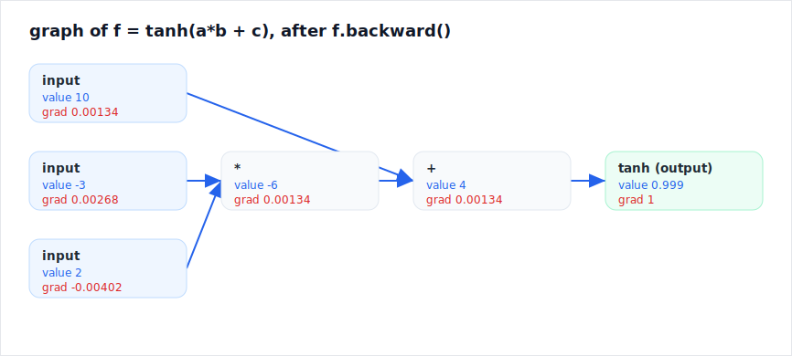
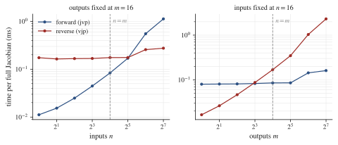
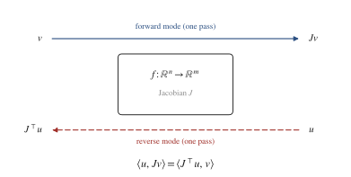
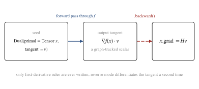

# A guide to autograd-from-scratch

This walks through the whole engine in the order it was built, then hands you a
set of open problems to extend it yourself. The idea is not to read it like a
reference but to build the same thing and check your work against the same tests.

Everything is one idea seen from three angles: **automatic differentiation is
the chain rule, applied mechanically.** Reverse mode applies it backward,
forward mode applies it forward, and second order applies it twice. Once you see
that, none of it is mysterious.

## 1. Reverse mode: the chain rule, backward (`engine.py`)


A `Tensor` wraps a NumPy array and, when it is produced by an operation, stores a
closure that knows that operation's local derivative. `backward()` builds a
topological order of the graph and walks it in reverse, handing each node its
output gradient and letting it push gradient to its inputs.

The only genuinely fiddly part is **broadcasting**. When `(C,)` is broadcast
against `(B, T, C)` in the forward pass, the backward pass has to sum the
gradient back *down* to `(C,)`. `_unbroadcast` does that, and getting it exactly
right is what makes the per-op checks in `test_engine.py` pass against PyTorch to
`1e-7`. Reverse mode is what training uses: one scalar loss, millions of inputs,
all their gradients in a single backward pass.

You can see any of this directly. `viz.py` draws the graph the engine actually built,
with each node's value and the gradient `backward()` filled in, so you can check the
chain rule by eye:



## 2. Forward mode: the chain rule, forward (`dual.py`)

A `Dual` carries a value and a **tangent** (a directional derivative) and pushes
the tangent forward through the same local derivatives. No graph, no topo sort.
One forward pass gives you a Jacobian-vector product `J v`. It is cheap in the
opposite regime from reverse mode: few inputs, many outputs.

That cost difference is not just a slogan, `benchmark.py` measures it. With outputs
fixed, forward-mode Jacobian time climbs with the input count while reverse stays flat,
and the two cross exactly where inputs equal outputs:



## 3. The part almost nobody builds: forward and reverse are adjoints



Reverse mode computes `Jᵀ u`. Forward mode computes `J v`. They are two sides of
one linear map, so for any `u`, `v`:

$$\langle u,\; J v\rangle \;=\; \langle J^\top u,\; v\rangle$$

`test_dual.py` checks this to `1e-10`. This is the heart of the repo: it is the
difference between "I can call `.backward()`" and "I understand that autodiff is
one linear map you can evaluate from either end." If your forward and reverse
code disagree, this identity breaks immediately, so it doubles as the strongest
correctness test in the project.

## 4. Second order: the chain rule, twice (`secondorder.py`)

Carry a *second* tangent and the same machinery gives exact second derivatives.
For a unary `g`, propagating `(value, t1, t2)` is just:

```
value = g(a)
t1    = g'(a) * a.t1
t2    = g''(a) * a.t1^2 + g'(a) * a.t2     # chain rule, differentiated again
```

For a scalar `f`, seed `t1 = v` and the output's `t2` is exactly the directional
curvature `vᵀ H v`, with no finite-difference error. That curvature is what
Newton's method needs, so `secondorder.py` ends with a from-scratch Newton
optimizer. On a smooth non-quadratic bowl it reaches machine precision in ~4
steps where gradient descent needs ~50. Curvature is the difference.

## 5. The capstone: differentiate through an optimizer (`implicit.py`)

Here is the one that sounds impossible. Let `x*(t) = argmin_x f(x, t)`. What is
`dx*/dt`? The naive answer is "unroll every optimizer step and backprop through
all of them." The right answer needs no unrolling at all. At the optimum the
gradient is zero, `grad_x f(x*, t) = 0`, and that holds for every `t`.
Differentiate it with the chain rule:

$$H_{xx}\,\frac{dx^*}{dt} + H_{xt} = 0 \;\Longrightarrow\; \frac{dx^*}{dt} = -H_{xx}^{-1} H_{xt}$$

One Hessian (we already have it) and one linear solve give the gradient of the
solution, no matter how many iterations the optimizer ran. This is the implicit
function theorem, and it is what powers deep equilibrium models and
optimization-as-a-layer. `implicit.py` checks it on ridge regression against the
closed-form `dx*/dlambda` (agreement to `1e-16`) and on a non-quadratic problem
against finite differences. Differentiating the *answer* to an optimization, not
the steps that found it, is a genuinely rare thing to have built by hand.

## 6. The two modes compose: Hessian-vector products (`hvp.py`)



Forward mode and reverse mode are not rivals, they stack. Reverse mode hands you
the gradient $g(x) = \nabla f(x)$. Push a forward-mode tangent $v$ through that
gradient and you get its directional derivative, which is exactly $H v$:

$$H v = \left.\frac{d}{d\epsilon}\, \nabla f(x + \epsilon v)\right|_{\epsilon=0}$$

The pieces already exist, so the core is only a few lines. Seed a `Dual` whose primal
is a reverse-mode `Tensor` and whose tangent is the direction $v$. The forward pass
produces the output tangent $\nabla f \cdot v$ as a `Tensor`; call `.backward()` on
that one scalar and the `Tensor`'s grad is $H v$. One forward-over-reverse pass, and
the $n \times n$ Hessian is never built, so this is the version that scales to a real
network. And `dual.py` only ever encodes each op's *first* derivative; reverse mode
differentiates that a second time on its own, so the second-order information falls
out for free.
`test_hvp.py` checks it against PyTorch's double-backward and the explicit Hessian
to machine precision.

And it works on a real model, not just toy scalars. `landscape.py` writes the trained
MLP's loss as a function of its 1218-parameter vector and uses the same `Hv` to find the
sharpness of the optimum (the largest Hessian eigenvalue) and the direction of sharpest
curvature, then walks the loss along it:


## 7. It actually trains things

- `train_mlp.py`: an MLP learning a non-separable spiral to 99.5%.
- `train_gpt.py`: a multi-head causal Transformer (the minimal-gpt architecture)
  trained end to end, every gradient from `engine.py`, overfitting a line to
  loss ~0.0002 and reproducing it.

If the engine were subtly wrong, neither of these would learn. They do.

## Explore it yourself

These are open. The repo gives you the oracle (PyTorch in the tests, the adjoint
identity, finite differences) so you can check any answer you reach.

1. **Add an operation to all three engines.** Pick `sin`. Work out its value,
   first derivative, and second derivative, add it to `Tensor`, `Dual`, and
   `Dual2`, and confirm it passes the gradient check, the adjoint identity, and
   the curvature-vs-torch test. You now know exactly what "registering an op"
   means in a real framework.

2. **Break Newton on purpose.** Run `newton_minimize` on a non-convex function
   whose Hessian goes indefinite (try `f = x0^2 - x1^2`). Watch it diverge or
   head for a saddle, and explain why from the Hessian. Then fix it (a damped or
   trust-region step). This is the real reason production optimizers are not raw
   Newton.

3. **Find where curvature stops paying off.** Vary the conditioning of a
   quadratic and measure Newton steps vs gradient-descent steps to a fixed
   accuracy. At what condition number does the gap explode? At what problem size
   does building the Hessian stop being worth it?

4. **Take `H v` to the GPT.** `landscape.py` already does this for the MLP: it measures
   the trained model's sharpness with `top_eigenvalue` and slices the loss along the
   sharpest Hessian direction, all on `hvp`, with no `H` ever formed. The open part is
   the Transformer. Express `train_gpt.py`'s loss as a function of its parameter vector
   and run the same analysis, or go further and draw a 2D landscape over the top two
   Hessian eigenvectors. `newton_cg` is waiting too: take a Hessian-free Newton step on
   a real loss.

5. **Time the two modes.** `benchmark.py` already measures the forward-vs-reverse cost
   crossover on a small map. Push it further: count graph nodes or op calls instead of
   wall-clock (machine-independent), or measure the same crossover on `train_gpt.py`'s
   loss to see where each mode wins on a real model.

## Running it

```bash
uv sync
uv run python -m pytest -q     # all checks: gradients, the adjoint proof, the Hessian
uv run python micrograd.py     # scalar warm-up
uv run python dual.py          # the forward/reverse adjoint identity
uv run python secondorder.py   # Newton vs gradient descent
uv run python hvp.py           # Hessian-vector products, no Hessian formed
uv run python viz.py           # draw the graph of an expression to SVG
uv run python train_gpt.py     # a GPT trained on the engine
uv run --group viz python benchmark.py   # forward vs reverse cost crossover
uv run --group viz python reproduce.py   # rerun everything, regenerate every figure
```
