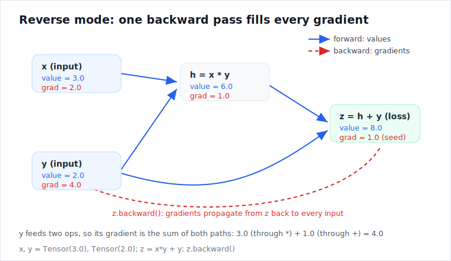
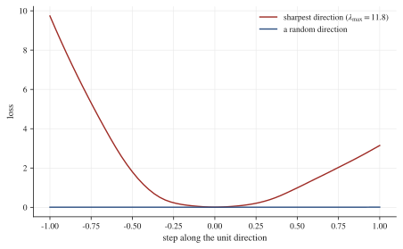

# autograd-from-scratch

I built this to understand what `loss.backward()` actually does. It is a small
automatic differentiation engine in plain NumPy: Karpathy's scalar
[micrograd](https://github.com/karpathy/micrograd) reimplemented first, then the
same idea lifted to arrays, then the things I got curious about after that:
forward mode, exact second derivatives, differentiating through an optimizer's
solution, and Hessian-vector products. A small MLP and a tiny GPT train on it.
PyTorch appears only in the tests, as a reference to check gradients against.

Reverse mode records each operation as you compute, then walks the graph
backward applying the chain rule, accumulating a gradient into every input. It
is cheap when there are few outputs and many inputs, which is what training is:
one scalar loss, many weights. Forward mode carries a derivative forward
alongside each value through the same local rules, and is cheap in the opposite
case. Everything in this repo is one of those two ideas, or the two composed.



## Quickstart

```bash
uv sync                        # numpy for the engine; torch and pytest for the tests
uv run python -m pytest -q     # gradient checks, the adjoint identity, second order

uv run python autograd/micrograd.py     # scalar engine, gradients worked out by hand
uv run python autograd/dual.py          # forward vs reverse: the adjoint identity
uv run python autograd/secondorder.py   # exact curvature, Newton vs gradient descent
uv run python autograd/implicit.py      # differentiate through an argmin
uv run python autograd/hvp.py           # Hessian-vector products without forming H
uv run python examples/train_mlp.py     # an MLP on a spiral
uv run python examples/train_gpt.py     # a tiny GPT, every gradient from the engine
uv run python autograd/viz.py           # draw the computation graph of an expression

uv run --group viz python examples/landscape.py   # curvature of the trained MLP
uv run --group viz python examples/benchmark.py   # forward vs reverse cost measurement
uv run --group viz python reproduce.py   # rerun everything, regenerate figures
```

## Learning from this repo

The code is one half; the other half is a set of materials for working through
it. They are meant to be used in roughly this order, but each stands on its
own.

### 1. [`walkthrough.ipynb`](walkthrough.ipynb), if autodiff is new to you

A notebook that builds a scalar autodiff engine from nothing, in the order the
ideas actually arrive: estimate a derivative by nudging a value, write a
`Value` class that only knows `+` and `*`, push gradients through a four-node
graph by hand, automate it with closures and a topological sort, hit the
classic gradient-overwrite bug and watch it give the wrong number, fix it, and
finish by training a three-neuron network whose loss visibly falls. Every step
is checked against the nudge estimate, so nothing has to be taken on faith.

The outputs are saved in the file, so you can read it straight on GitHub. To
run and edit it locally:

```bash
uv run --with notebook jupyter notebook walkthrough.ipynb
```

### 2. [`GUIDE.md`](GUIDE.md), the walkthrough of the real engine

The guide covers the repo in the order it was built, one section per idea:
reverse mode with a fully hand-traced backward pass, broadcasting and why it
is where tensor gradients go wrong, forward mode, the adjoint identity that
ties the two modes together, second order, implicit differentiation,
Hessian-vector products, the curvature of the trained network, and the
training loop itself.

It starts with a short section on the math it needs (gradient, Jacobian, chain
rule as matrix multiplication, Hessian) and ends with a glossary, so the only
real prerequisites are Python and the single-variable chain rule. Each section
names the test that verifies the idea and notes what broke while building it,
because the bugs are at least as instructive as the code. Seven exercises are
placed where you have just learned enough to attempt them.

Use it with the code open: run the script each section talks about, then read
the section, then read the source file.

### 3. [`challenge/`](challenge/), rebuild the engine yourself

The strongest way through this material is writing the engine against the same
tests that verify mine. The challenge directory has two skeleton files
(`engine_skeleton.py`, `dual_skeleton.py`) where every method states its
contract and raises `NotImplementedError`, plus checkpoint tests numbered in
build order: scalar ops, the backward walk, unbroadcasting, matmul, the
remaining ops, forward mode, and finally the adjoint identity binding your two
engines together.

The loop is one command:

```bash
uv run python -m pytest challenge -x   # stops at exactly the next thing to implement
```

Implement the method it failed on, run it again, repeat. The checks are
framework-free (hand-computed numbers and finite differences), so you never
need PyTorch for this part. The rules and checkpoint list are in
[`challenge/README.md`](challenge/README.md). If you want to confirm the checkpoints themselves are
sound, `CHALLENGE_REFERENCE=1 uv run python -m pytest challenge -q` runs them
against the repo's real engine; all of them pass.

### 4. [`solutions/`](solutions/), when you are stuck or done

Worked answers, each with a try-first warning at the top:

- [`solutions/01_add_sin.md`](solutions/01_add_sin.md): adding a new op
  (`sin`) to all three classes, with the exact code and the checks to run
  against finite differences and the adjoint identity. This is the best first
  exercise; after it, "registering an op" in a real framework is no longer
  mysterious.
- [`solutions/02_break_newton.md`](solutions/02_break_newton.md): running
  Newton's method into a saddle point on purpose, why the Hessian explains
  it, and a damped fix.
- [`solutions/03_zero_grad.md`](solutions/03_zero_grad.md): what happens when
  you skip `zero_grad()`, and why gradient accumulation is correct within one
  backward pass but wrong across steps.
- [`solutions/README.md`](solutions/README.md): answers to the guide's
  warm-up exercises and sketches for the open ones (the condition-number
  sweep, measuring the GPT's curvature, an op-count version of the
  benchmark).

### 5. [`NOTES.md`](NOTES.md), the write-up

What I learned building each piece, in the order I built them: the bugs that
left regression tests behind (the cross-entropy clamp, the recursion limit,
the 0 times infinity NaN, conjugate gradient dying on a saddle), the benchmark
that refused to cross where the textbook argument said it would and why, and a
table of what is checked against what. Read it whenever; it pairs well with
the guide but assumes nothing from it.

## Results

Numbers from the current code; `reproduce.py` reruns all of them.

- Per-op reverse-mode gradients match PyTorch to 1e-7, and a separate
  finite-difference check needs no framework at all (`tests/test_engine.py`).
- Forward and reverse mode agree as adjoints: $\langle u, Jv \rangle =
  \langle J^\top u, v \rangle$ to 1e-10, and full Jacobians built column-wise
  (forward) and row-wise (reverse) match (`tests/test_dual.py`).
- Second derivatives match PyTorch's double-backward to 1e-8. Newton's method
  with exact curvature reaches the minimum of a smooth bowl in about 4 steps;
  gradient descent at lr 0.1 takes 50 (`autograd/secondorder.py`).
- Implicit differentiation through an argmin matches the closed-form ridge
  derivative to about 1e-16 (`autograd/implicit.py`).
- Hessian-vector products, computed forward-over-reverse without building the
  Hessian, match an explicitly assembled Hessian to about 4e-16 (`autograd/hvp.py`).
- The MLP reaches 99.5% on a two-class spiral; the GPT drives its loss from
  3.15 to 0.0002 and reproduces its training text exactly (`examples/train_gpt.py`).
- The trained MLP's loss, as a function of all 1218 parameters, has top
  Hessian eigenvalue about 11.8, measured with the engine's own Hessian-vector
  products (`examples/landscape.py`).



## Files

| Path | What it is |
|------|------------|
| **[`autograd/`](autograd/) — the engine** | |
| [`micrograd.py`](autograd/micrograd.py) | Scalar reverse-mode autograd (Karpathy's micrograd, reimplemented) |
| [`engine.py`](autograd/engine.py) | The tensor engine: reverse mode on NumPy arrays, broadcasting-aware backward |
| [`dual.py`](autograd/dual.py) | Forward mode: dual numbers, `jvp`/`vjp`/`jacobian`, the adjoint check |
| [`secondorder.py`](autograd/secondorder.py) | Order-2 duals: exact second derivatives, dense Hessian, Newton |
| [`implicit.py`](autograd/implicit.py) | Implicit differentiation: gradients through an argmin |
| [`hvp.py`](autograd/hvp.py) | Hessian-vector products (Pearlmutter), top eigenvalue, Newton-CG |
| [`nn.py`](autograd/nn.py) | Linear, Embedding, LayerNorm, Adam, SGD, built on the engine |
| [`viz.py`](autograd/viz.py) | Renders a computation graph (values and grads) to SVG |
| **[`examples/`](examples/) — things the engine does** | |
| [`train_mlp.py`](examples/train_mlp.py) | An MLP on a spiral |
| [`train_gpt.py`](examples/train_gpt.py) | A small multi-head causal Transformer, trained end to end |
| [`landscape.py`](examples/landscape.py) | Curvature of the trained MLP via the engine's own Hv |
| [`benchmark.py`](examples/benchmark.py) | Forward vs reverse cost of a full Jacobian, measured |
| [`figures.py`](examples/figures.py) | Regenerates the explainer diagrams in `assets/` |
| **Learning materials** | |
| [`walkthrough.ipynb`](walkthrough.ipynb) | Build the scalar engine from nothing, step by step |
| [`GUIDE.md`](GUIDE.md) | The walkthrough: prerequisites, hand traces, exercises, glossary |
| [`challenge/`](challenge/) | Rebuild the engine yourself against checkpoint tests |
| [`solutions/`](solutions/) | Worked answers and hints for the exercises |
| [`NOTES.md`](NOTES.md) | What building this taught me, and what is verified against what |
| **Verification** | |
| [`tests/`](tests/) | Per-op checks vs PyTorch, finite differences, the adjoint identity |
| [`reproduce.py`](reproduce.py) | One command: tests, every demo, every figure |

## Limitations

This is a float64 CPU engine written to be read, not to be fast. Nobody should
use it in place of PyTorch or JAX. The Newton optimizer is the raw
$x \leftarrow x - H^{-1}\nabla f$ and walks to saddle points as readily as to
minima. The power-iteration eigenvalue has no convergence check and can be
silently wrong when the extreme eigenvalues have equal magnitude. The curvature
measurement has only ever been run on a 1218-parameter network. None of the
techniques are new.

## Credit

The scalar engine is Andrej Karpathy's
[micrograd](https://github.com/karpathy/micrograd), reimplemented to understand
it. The tensor engine, forward mode, and the second-order parts grew out of
that. Pearlmutter (1994) for Hessian-vector products; Li et al. (2018) for the
idea of slicing loss landscapes.
